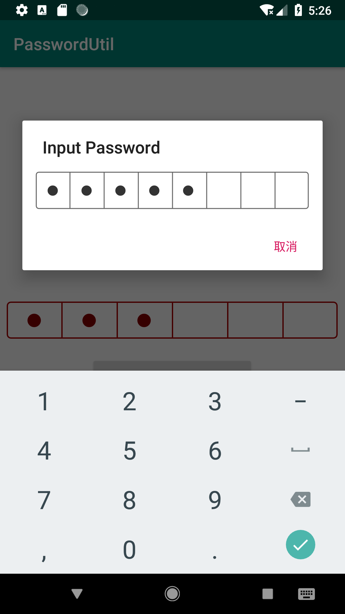

# PasswordUtil

[](https://jitpack.io/#IvanLuLyf/PasswordUtil)
[](https://android-arsenal.com/api?level=23)
[](https://travis-ci.org/IvanLuLyf/PasswordUtil)
[](https://github.com/IvanLuLyf/PasswordUtil/blob/master/LICENSE)

一个模仿微信支付和支付宝的密码输入框.

## 项目配置

添加以下内容到项目的build.gradle文件里面:

```gradle
allprojects {
    repositories {
        ...
        maven { url 'https://jitpack.io' }
    }
}
```

添加项目依赖

```gradle
dependencies {
    implementation 'com.github.IvanLuLyf:PasswordUtil:1.1'
}
```

## 使用

### 直接使用PasswordView
```xml
<cn.twimi.widget.PasswordView
        android:id="@+id/passwordView"
        android:layout_width="match_parent"
        android:layout_height="wrap_content"
        app:border_color="#AA0000"
        app:border_width="4"
        app:circle_width="8"
        app:fore_color="#880000"
        app:max_length="6" />
```

```java
PasswordView passwordView = findViewById(R.id.passwordView);
passwordView.setOnCompleted(new PasswordView.OnCompleted() {
    @Override
    public void onCompleted(String password) {
        // 处理密码的逻辑
    }
});
```

### 使用PasswordDialogUtil
```java
(new PasswordDialogUtil.Builder(MainActivity.this)).setOnCompleted(new PasswordDialogUtil.OnPasswordCompleted() {
    @Override
    public void onCompleted(String password) {
        // 处理密码的逻辑
    }
})
.setMaxLength(8)    // 设置密码的最大长度
.setTitle("输入密码") // 设置对话框标题
.build()    // 构建对话框
.show();    // 显示对话框
```

## 效果图


